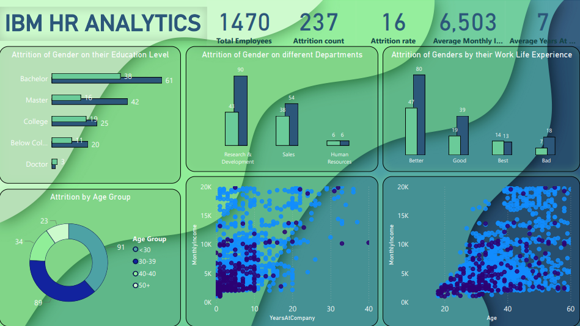

# 📊 HR Attrition Analysis (Power BI)

This project analyzes HR data to understand patterns and drivers of employee attrition using **Power BI**.

---

## 🚀 Project Overview
- **Objective:** Identify factors that contribute to employee attrition and provide insights to HR for improving retention.
- **Dataset:** Contains 1470 employees with features such as Age, Department, Education, Job Role, Income, Work-Life Balance, etc.
- **Tool Used:** Power BI Desktop

---

## 📈 Key Insights
- **Total Employees:** 1470  
- **Attrition Count:** 237  
- **Attrition Rate:** 16%  
- **Average Monthly Income:** 6503  
- **Average Years at Company:** 7  

---

## 🖼️ Dashboard Preview
Below is the Power BI dashboard created for this analysis:




---

## 📊 Visuals in the Dashboard
- **KPIs (Cards):** Total Employees, Attrition Count, Attrition Rate, Avg Monthly Income, Avg Tenure  
- **Attrition by Department:** Breakdown across Research & Development, Sales, and HR  
- **Attrition by Gender & Work-Life Balance**  
- **Attrition by Education Level**  
- **Attrition by Age Groups**  
- **Scatter Plots:**  
  - Years at Company vs Monthly Income (highlighting Attrition)  
  - Age vs Monthly Income (highlighting Attrition)  

---

## 🧮 DAX Measures Used
```DAX
Total Employees = COUNTROWS(Employee)

Attrition Count = CALCULATE(COUNTROWS(Employee), Employee[Attrition] = "Yes")

Attrition Rate = DIVIDE([Attrition Count], [Total Employees], 0)

Average Monthly Income = AVERAGE(Employee[MonthlyIncome])

Average Years At Company = AVERAGE(Employee[YearsAtCompany])
